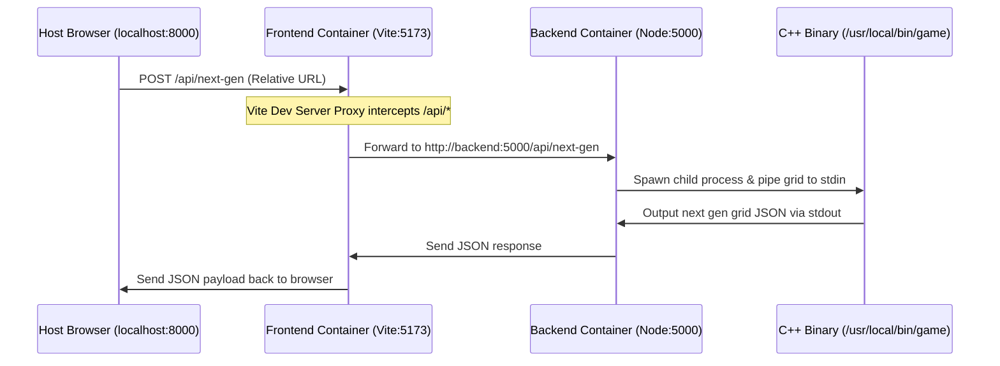

# Conway's Game of Life


---

## 📖 Project Summary

This project is a modern, high-performance, full-stack implementation of **Conway's Game of Life** built inside a multi-container Docker architecture. 

It implements a hybrid architecture:
* A **highly-optimized C++ engine** compiles to a static binary and computes grid state transformations at native speed.
* A **Node.js/Express backend** serves as a wrapper API, spawning the C++ binary via standard streams (`stdin`/`stdout`) for computing the next generation.
* A responsive **React / TypeScript frontend** stylized with **Tailwind CSS** enables interactive drawing, autoplay simulation, and fluid 1.5-second state animations (highlighting birth transitions in **green**, death states in **red**, and stable cells in **cyan**).

---

## 🛠️ Project Structure

```text
GameOfLife/
├── backend/
│   ├── Dockerfile          # Multi-stage Docker build compiling C++ and starting Express
│   ├── file.cpp            # OOP-based C++ engine logic (Canonical Class Form)
│   ├── package.json        # Node.js backend dependencies
│   └── server.js           # Express API server (spawns game subprocess)
├── frontend/
│   ├── src/
│   │   ├── App.tsx         # Main React simulation control board
│   │   ├── index.css       # Tailwind CSS declarations
│   │   └── main.tsx
│   ├── Dockerfile          # Frontend container configuration
│   ├── package.json        # Frontend React/Vite dependencies
│   └── vite.config.ts      # Vite configuration & internal reverse-proxy settings
├── docker-compose.yml      # Multi-container orchestration (network & volumes)
├── Makefile                # Automation commands (up, down, re, status, logs)
└── README.md               # Project documentation
```

---

## 🚀 How to Install and Run

This project uses a `Makefile` to simplify Docker orchestration. Ensure you have **Docker** and **Docker Compose** installed.

### 1. Build and Start the Containers
To pull/compile the images and start the services in the background:
```bash
make up
```

### 2. Verify Container Status
Check if all containers are running successfully:
```bash
make status
```

### 3. Access the Game Dashboard
Open your browser and navigate to:
* **Frontend UI**: [http://localhost:8000](http://localhost:8000)

### 4. Restarting the Application (Quick Reload)
To restart the active containers (useful if you make modifications):
```bash
make re
```

### 5. Viewing Container Logs
To follow the active server/client output:
```bash
make logs
```

### 6. Tearing Down and Cleaning
To stop the services and clean up containers and networks:
```bash
make down
```
To clean up along with all persistent named node modules volumes:
```bash
make clean
```

---

## ⚙️ Technologies Used and Why

| Technology | Purpose | Rationale |
| :--- | :--- | :--- |
| **C++ (OOP, CCF)** | Game Algorithm Engine | Calculating cell states requires fast CPU execution. C++ operates at native execution speed with zero virtual machine overhead. Written in Orthodox Canonical Class Form (CCF) for robust resource management. |
| **Node.js & Express** | REST API Layer | Handles HTTP requests asynchronously and coordinates system subprocesses (spawning the compiled C++ executable) with minimal overhead. |
| **React & TypeScript** | Client Interface | React's virtual DOM delivers fast UI updates for the grid. TypeScript provides compile-time type-safety for complex state arrays. |
| **Vite** | Frontend Server & Bundler | Provides near-instantaneous hot module replacement (HMR) and developer builds compared to slower tooling. |
| **Tailwind CSS** | Premium Interface styling | Rapid prototyping utility framework that builds a responsive, glowing slate interface with smooth micro-animations. |
| **Docker Compose** | Orchestration & Deployment | Standardizes the stack into isolated service containers (networks, volumes), ensuring the app runs identically on any system. |

---

## 🔄 Front-End to Back-End Communication & Security

### 1. Network Isolation (Private Backend)
The backend container is isolated from the host machine. The `ports` section is omitted for the `backend` service inside `docker-compose.yml`, which means **port 5000 is closed to the outside world**. 

### 2. Vite Reverse-Proxy Architecture
The frontend container communicates with the backend container using Docker's internal DNS network resolution:


Vite is configured with a reverse-proxy inside `vite.config.ts`:
```typescript
proxy: {
  '/api': {
    target: 'http://backend:5000',
    changeOrigin: true,
  }
}
```
This design improves security by hiding backend endpoints from public ports, keeping communication inside a localized Docker network.

---

## 🔮 Upcoming Features (Roadmap)

We plan to expand Conway's Game of Life into a social gaming dashboard:

1. **User Authentication & Database Integration**:
   * Add a secure login system (JWT) backed by a database (PostgreSQL/MongoDB).
   * Enable users to save their favorite starting grid layouts and board patterns.

2. **Player Dashboard & Stats Tracking**:
   * Build dashboards to display stats like generation records, grid density charts, active runtime metrics, and population growth history.

3. **Global Multi-player Chat**:
   * Integrate WebSockets (Socket.io) to allow active players to chat in real-time, share grid layouts, and request advice.

4. **AI Fun Interactions**:
   * Incorporate a lightweight AI model to predict grid outcomes (e.g., detecting if a grid is heading toward static stagnation/oscillators) and recommend placements to prolong grid survival.
